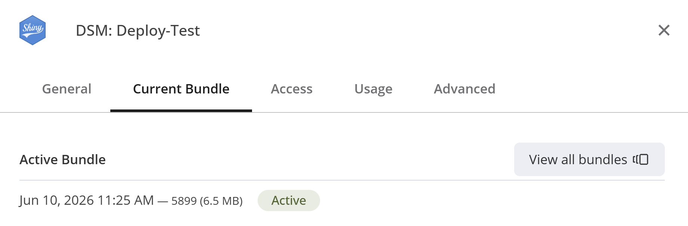
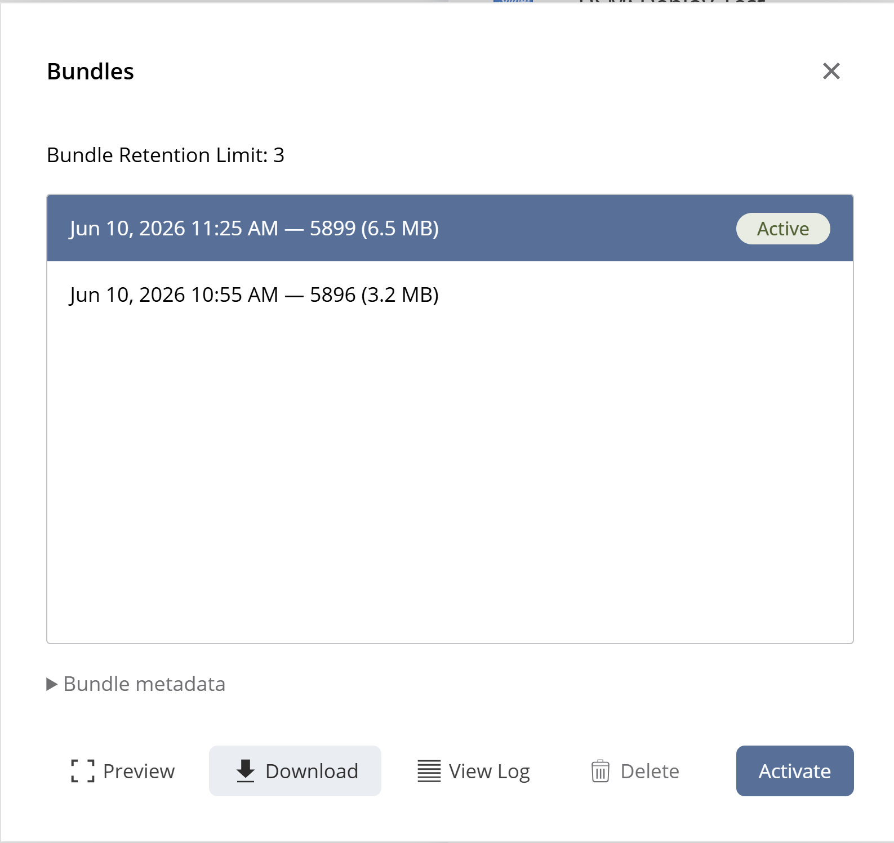
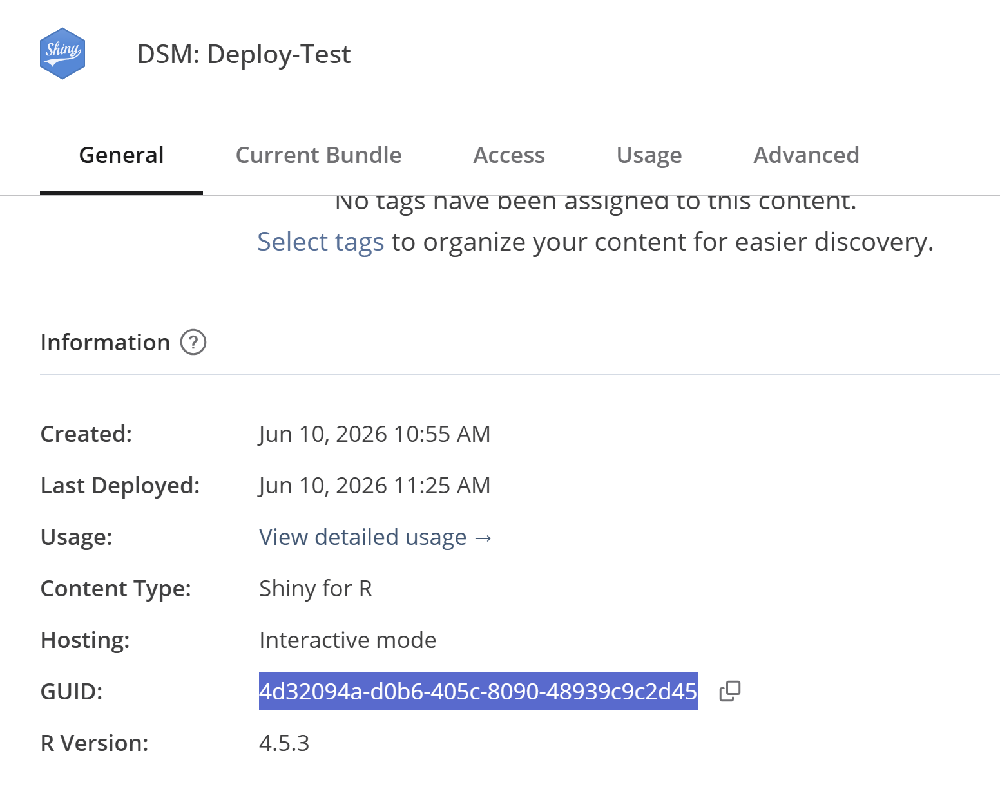

# (Re)-deploying Shiny Apps

## Deploying from an `appStructure`

We can deploy a shiny app directly from an `appStructure` object. We can
do this by calling
[`deployAppStructure()`](https://darwin-eu-dev.github.io/DarwinShinyModules/reference/deployAppStructure.md)

``` r

deployAppStructure(
  appStructure = appStructure,
  appDir = tempdir())
```

[`deployAppStructure()`](https://darwin-eu-dev.github.io/DarwinShinyModules/reference/deployAppStructure.md)
is basically a wrapper around
[`rsconnect::deployApp()`](https://rstudio.github.io/rsconnect/reference/deployApp.html).
[`deployAppStructure()`](https://darwin-eu-dev.github.io/DarwinShinyModules/reference/deployAppStructure.md)
has the dot-dot-dot parameter (`...`) that will pass any other
parameters you specify to
[`rsconnect::deployApp()`](https://rstudio.github.io/rsconnect/reference/deployApp.html).
This allows you to pass things like an `appId` or account arguments.

## Re-deployment

Lets say we would like to restructure our shiny app based on some
feedback we have gotten. We can download a tar.gz file from posit:

settings -\> Current Bundle -\> View all bundles -\> Download

You can select the bundle to download, but usually you want the one
labeled as “active”.





This file is structured as followed:

    bundle-xxxx.tar.gz
      |- .
        |- <...>
        |- appStructure.qs

There is no need to unpack the tar.gz-file, `loadFromDisk()` will
extract the `appStructure` object for us:

``` r

appStructure <- loadAppStructure(
  filePath = "./bundle-xxxx.tar.gz",
  appStructureFileName = "appStructure.qs"
)
```

Now we have an identical copy of the `appStructure` that we made before.
We can alter the `appStructure` as we like:

``` r

# Remove `base`
appStructure$base <- NULL

# Re-order alphabetically:
appStructure <- appStructure[sort(names(appStructure))]
```

With our updates made, we can re-deploy our app, by using the
[`deployAppStructure()`](https://darwin-eu-dev.github.io/DarwinShinyModules/reference/deployAppStructure.md)
function again, note that we pass the `appId` argument, which is found
in the `info` tab on posit:



``` r

deployAppStructure(
  appStructure = appStructure,
  appDir = tempdir(),
  appId = 123
)
```
