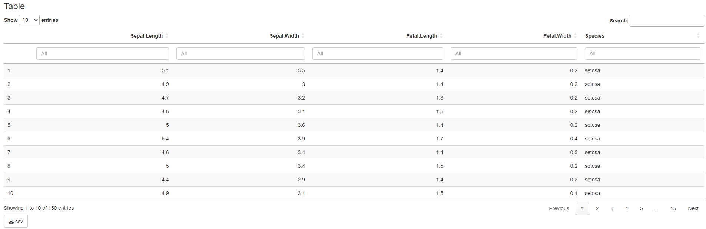
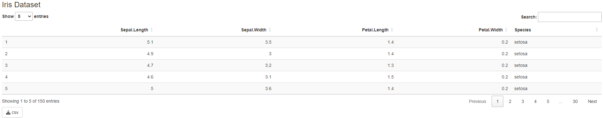
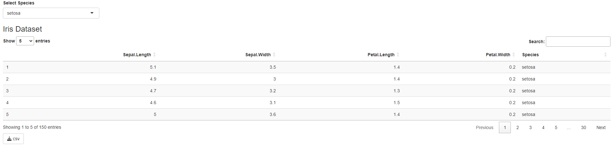
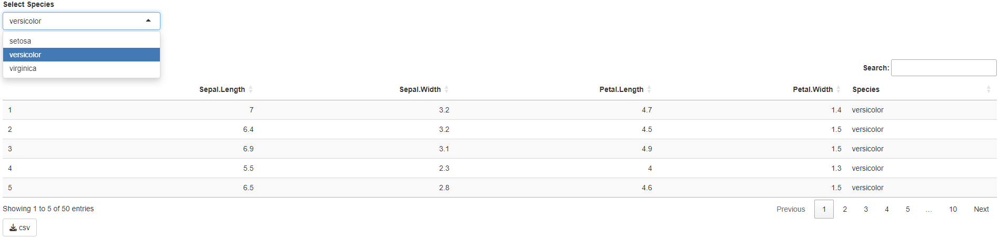

```{r, include = FALSE}
knitr::opts_chunk$set(
  collapse = TRUE,
  comment = "#>"
)
```

## Introduction
In this vignette we will discuss how to use various shiny modules in a shiny app. The shiny app exists out of two components: the UI, and the server:
```{r}
server <- function(input, output, session) {
  
}

UI <- shiny::fluidPage(
  
)

if (interactive()) {
  shiny::shinyApp(ui = UI, server = server)
}
```

These two components will be the foundation of our shiny app.

## Adding a module
Let's add a table containing the `iris` data. First we need to create a Table module:
```{r}
library(DarwinShinyModules)

table <- Table$new(data = iris)

table
```

The table module is an `R6` class and contains various public and private fields and methods. Some of these are specific to the `Table` module. But most of them are present in all `DarwinShinyModule` modules. All modules have a `server()` and `UI()` method. These methods are used make the shiny app function, and may be used on their own by `shiny::shinyApp()`. This makes each module essentially a tiny stand-alone shiny app.

To integrate our module in our own shiny app, all we have to do is add the `UI()` and `server()` method calls to our own shiny app:
```{r}
server <- function(input, output, session) {
  table$server(input, output, session)
}

UI <- shiny::fluidPage(
  table$UI()
)

if (interactive()) {
  shiny::shinyApp(ui = UI, server = server)
}
```
{#id .class width=100%}

We have some arguments to customize our table, `title`, `options`, `filter`. The `options` and `filter` arguments are `DT` arguments to add extra options, or to have control over the filtering.
```{r}
table <- Table$new(
  data = iris,
  title = "Iris Dataset",
  options = list(pageLength = 5),
  filter = "none"
)

server <- function(input, output, session) {
  table$server(input, output, session)
}

UI <- shiny::fluidPage(
  table$UI()
)

if (interactive()) {
  shiny::shinyApp(ui = UI, server = server)
}
```
{#id .class width=100%}

Maybe we don't like the standard filtering that `DT` provides, let's add an `InputPanel` module. The `InputPanel` module requires a named list of `xInput()` functions and a named list of their corresponding arguments. The upside of this is, that if you may add an input function from another package, without breaking compatibility.
```{r}
inputPanel <- InputPanel$new(
  funs = list(
    inputSpecies = shiny::selectInput
  ),
  args = list(
    inputSpecies = list(
      inputId = "inputSpecies",
      label = "Select Species",
      choices = unique(iris$Species),
      selected = unique(iris$Species)[1]
    )
  )
)

inputPanel
```

Before we add our `InputPanel` let's see what it contains. It again has a `server()` and `UI()` method, but it now also has a `inputValues` active binding. `inputValues` is a reactive environment, where the input is stored from all the added `xInput()` functions. The reference for each value is the specified `inputId` in the `args` arguments list when creating a new `InputPanel` module.

Again we can add the `server()` and `UI()` method calls to our shiny app. Note that the UI is rendered first come, first serve:
```{r}
server <- function(input, output, session) {
  table$server(input, output, session)
  inputPanel$server(input, output, session)
}

UI <- shiny::fluidPage(
  inputPanel$UI(),
  table$UI()
)

if (interactive()) {
  shiny::shinyApp(ui = UI, server = server)
}
```
{#id .class width=100%}

Initially the selection input shows the correct thing, but doesn't actually filter the data in the table. We have to update the data in the `Table` module.
```{r}
server <- function(input, output, session) {
  table$server(input, output, session)
  inputPanel$server(input, output, session)

  # The `inputSpecies` reference is availible in the reactive `inputValues`
  # envrionment in the `inputPanel`.
  shiny::observeEvent(inputPanel$inputValues$inputSpecies, {
    # We update the data in the `table` module
    table$data <- iris %>%
      dplyr::filter(.data$Species == inputPanel$inputValues$inputSpecies)
  })
}

UI <- shiny::fluidPage(
  inputPanel$UI(),
  table$UI()
)

if (interactive()) {
  shiny::shinyApp(ui = UI, server = server)
}
```
{#id .class width=100%}

With some minor overhead we can make two modules communicate data between one another.
