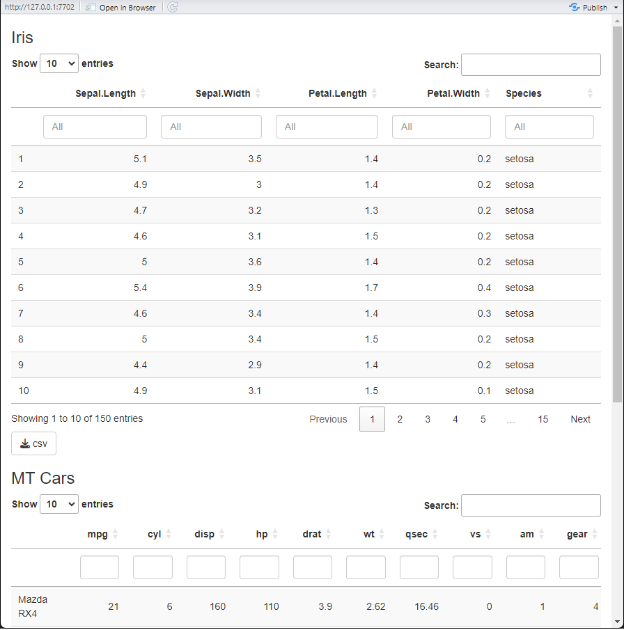
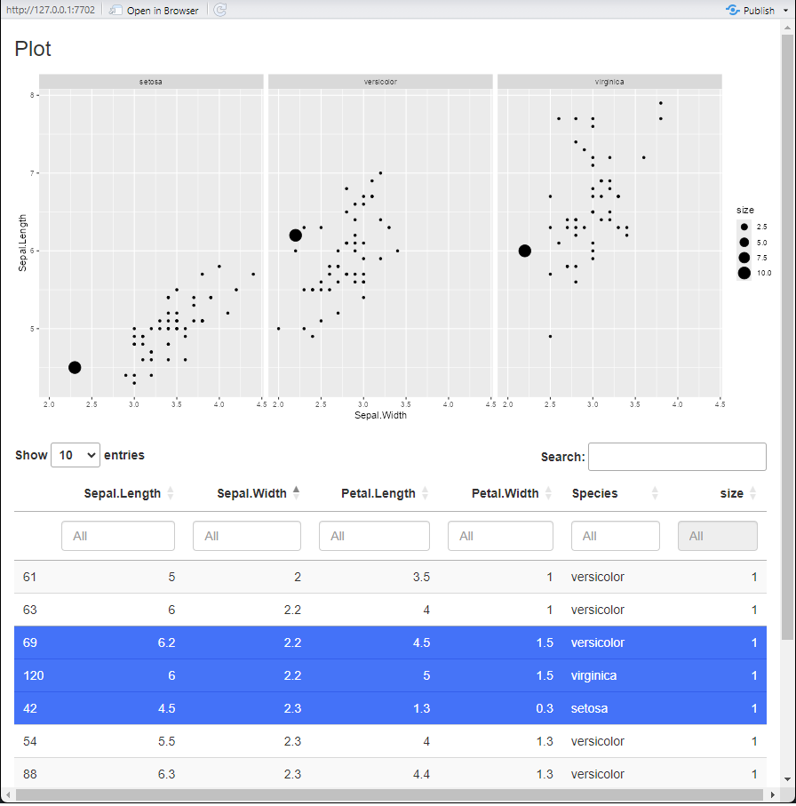
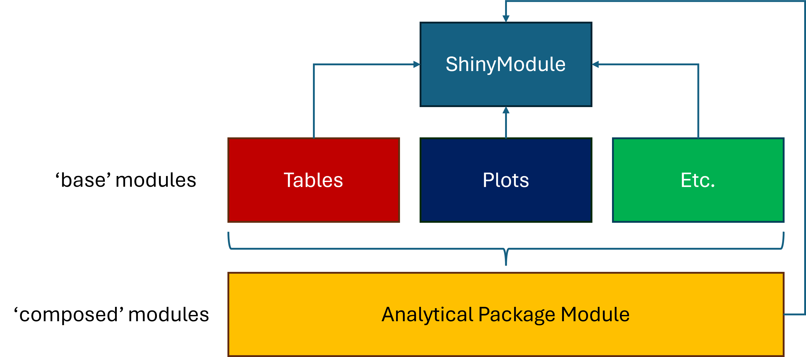

```{r, include = FALSE}
knitr::opts_chunk$set(
  collapse = TRUE,
  comment = "#>"
)
```

## Motivation
Shiny apps are a wonderful way to communicate data to others. It allows for interactivity to get additional insights into the data without completely re-running an analysis and re-generating a report.

Within the OHDSI sphere it is customary that a study has a accompanying shiny app, to visualize the data. `OhdsiShinyModules` and `ShinyAppBuilder` were developed to standardize shiny apps for commonly ran analyses, mainly from the `HADES` suite.

`ShinyAppBuilder` seems to be air tight in the way it functions, without much room for flexibility. It has to, to maintain the level of standardization it provides. It offers the most extreme opposite of what developing a fully customized shiny app would be.

`DarwinShinyModules` attempts to strike the middle ground between both. It deals with the overhead of `shiny`, like namespaces, reactive environments, and server execution; provides pre-specified modules to rapidly develop functional shiny apps, but stays flexible enough to include custom additions to your shiny app.

## Kinds of modules
The idea behind `DarwinShinyModules` is that one component can be a module. A component may be a plot, a table, text, etc. These kinds of modules contain code to deal with some kind of data, and present the output in a standardized way. For instance a `Table` module might show a form of tabular data like a `data.frame` the same standardizes way, independent of the contents of the data.

As an example we can display the contents of the `iris` and `mtcars` data sets in a similar fashion:
```{r, eval=FALSE}
library(DarwinShinyModules)

tableIris <- Table$new(iris, title = "Iris")
tableMtcars <- Table$new(mtcars, title = "MT Cars")

preview(list(tableIris, tableMtcars))
```
{#id .class width=100%}

Notice that both tables are effectively formatted the same, and that only the data contained within is different. Both have a button to download the visualized data in the bottom left, both are search-able per column, etc.

We will call modules that deal directly with data like this **base** modules. These modules are the lowest level of module there is when building other modules or shiny apps. These modules can be directly used in any form of shiny app, or other module.

The second kind of module in `DarwinShinyModules` is a **composed** module. This kind of module is a for a large part of its server code composed of other modules. Additional code can make it so these modules can communicate with each other.

As an example, this server function uses the pre-specified `table` and `plot` server methods. A small amount of code is then added to update a "size" column in the data, depending on what rows are selected in the table, and then updated in the `plot`. The `plot` will then update with the updated data.
```{r, eval=FALSE}
server = function(input, output, session) {
  # Server method for the `plot`
  private$.plot$server(input, output, session)
  # Server method for the `table`
  private$.table$server(input, output, session)

  # Additional code that fetches `rows_selected` from the `table` module, and
  # uses it to update the data in the `plot` module
  shiny::observeEvent(private$.table$bindings$rows_selected, {
    private$.data[, "size"] <- 1
    private$.data[private$.table$bindings$rows_selected, "size"] <- 10
    private$.plot$args$data <- private$.data
  })
}
```


The full underlying code is out of scope of this vignette, but included at the end of this vignette for completeness in supplementary A.

## Module hierarchy
Now that we know what kind of modules we have, we can explore the hierarchy of modules. `DarwinShinyModules` uses `R6` to implement each module. Even though R is a functional language and does not inherently support Object Oriented Programming (OOP), this style of code organisation lends itself very well to create shiny modules and gives a sense of "state" within each module. This "state" can then be manipulated during run time depending on user input, changing the behavior of (other) modules dynamically.

A sense of "state" is also achievable with purely functions, and functional programming but the data is has to live in either the global environment, on disk, or the data needs to be attached to a function environment:
```{r}
foo <- function(x) {
  z <- x

  function(y) {
    z * y
  }
}

bar <- foo(2)

bar(3)
```
All of these options seem like a more round about way of doing things, for this use case.

`DarwinShinyModules` uses inheritance to inherit common functionality between modules, following a "decorator" style design pattern. The idea behind this is that inheritance should come naturally, and (hopefully) intuitively.

{#id .class width=100%}

At the top of this hierarchy is the `ShinyModule` class. This class deals with the overhead of `shiny`, like namespaces, reactive environments, and server execution. All other modules in `DarwinShinyModules` inherit from this module. The second layer of modules are the 'base' modules described earlier. Some of these modules might have an intermediate parent class. For instance the `PlotStatic`, `PlotWidget`, and `PlotPlotly` inherit from a `Plot` class. This is mostly due to the specific `renderX()` and `XOutput()` functions specific for each kind of plot. Finally in the third layer are the 'composed' modules.

## Suplementals
### A: Full code
```{r, eval=FALSE}
ExampleModule <- R6::R6Class(
  classname = "ExampleModule",
  inherit = ShinyModule,
  
  active = list(),
  public = list(
    initialize = function() {
      super$initialize()
      private$.data <- iris
      private$.data$size <- 1
      private$.table <- Table$new(private$.data, title = NULL)
      private$.table$parentNamespace <- self$namespace
      
      private$.plot <- PlotStatic$new(fun = private$.plotFun, args = list(data = private$.data))
      private$.plot$parentNamespace <- self$namespace
    }
  ),
  private = list(
    .data = NULL,
    .table = NULL,
    .plot = NULL,
    
    .UI = function() {
      shiny::tagList(
        private$.plot$UI(),
        private$.table$UI()
      )
    },
    
    .server = function(input, output, session) {
      private$.plot$server(input, output, session)
      private$.table$server(input, output, session)

      shiny::observeEvent(private$.table$bindings$rows_selected, {
        private$.data[, "size"] <- 1
        private$.data[private$.table$bindings$rows_selected, "size"] <- 10
        private$.plot$args$data <- private$.data
      })
    },
    
    .plotFun = function(data) {
      ggplot2::ggplot(data = data) +
        ggplot2::geom_point(mapping = ggplot2::aes(x = Sepal.Width, y = Sepal.Length, size = size)) +
        ggplot2::facet_grid(. ~ Species)
    }
  )
)

mod <- ExampleModule$new()
preview(mod)
```
