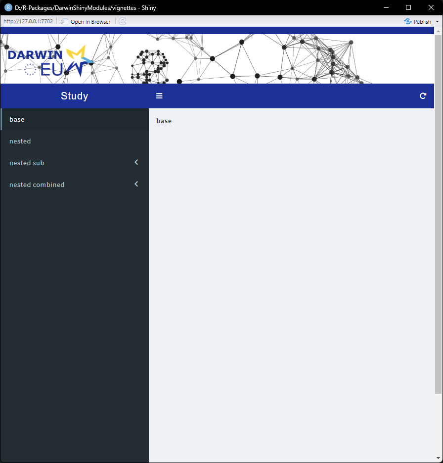

```{r, include = FALSE}
knitr::opts_chunk$set(
  collapse = TRUE,
  comment = "#>"
)
```

## Shiny app builders
`DarwinShinyModules` provides app builder functions. These are functions that ingest an app structure of `ShinyModule` objects to automatically create a shiny app

Lets create some simple Text modules to showcase the building process:
```{r}
library(DarwinShinyModules)

base <- Text$new("**base**")
nested_a <- Text$new("**nested A**")
nested_b <- Text$new("**nested B**")
sub_a <- Text$new("**sub A**")
sub_b <- Text$new("**sub B**")
comb_a <- Text$new("**comb A**")
comb_b <- Text$new("**comb B**")
comb_c <- Text$new("**comb C**")
```

We can organize the modules in a nested named list. Where the names of the overarching list are the main menu items, and subsequent names are sub menu items.
```{r, eval=FALSE}
appStructure <- list(
  # `base` on a page
  base = base,

  # Combine `nested_a` and `nested_b` Text on a page
  nested = list(nested_a, nested_b),

  # `sub_a` and `sub_b` on separate sub menu item
  nested_sub = list(
    sub_a = sub_a,
    sub_b = sub_b
  ),

  nested_combined = list(
    # Combine `comb_a` and `comb_b` on one page in a sub menu item
    comb_a_b = list(comb_a, comb_b),

    # `comb_c` on a separate sub menu item
    comb_c = comb_c
  )
)

launchShinydashboardApp(appStructure)
```
{#id .class width=100%}

We can also use the `darwinApp()` function to get a DARWIN EU© themed shiny app.
```{r, eval=FALSE}
darwinApp(appStructure, title = "Study")
```
{#id .class width=100%}
