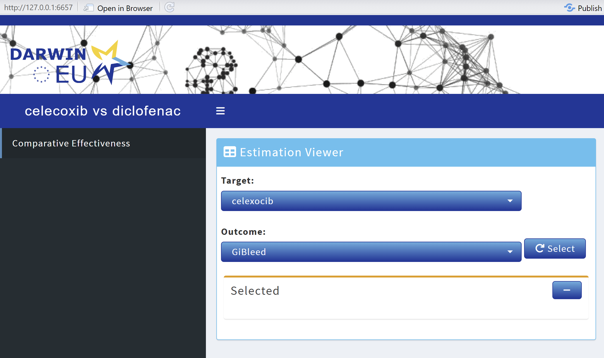

```{r, include = FALSE}
knitr::opts_chunk$set(
  collapse = TRUE,
  comment = "#>"
)
```

## Compatibility
`DarwinShinyModules` is compatible with other modules or shiny code. One module that you might have noticed in the documentation is the `OhdsiModule`. The `OhdsiModule` is a module that wraps around the `xViewer` and `xServer` functions. This enables you to easily integrate already existing modules from `OhdsiShinyModules` into your shiny apps built with `DarwinShinyModules`.

The base setup to do this would look something like this:
```{r eval=FALSE}
# Create connection details to the results database
connectionDetails <- DatabseConnector::createConnectionDetails(
  dbms = "sqlite",
  server = "./results.sqlite"
)

# Create a ConnectionHandler object
connectionHandler <- ResultModelManager::ConnectionHandler$new(
  connectionDetails = connectionDetails
)

# Make our module
estimation <- OhdsiModule$new(
  connectionHandler = connectionHandler,
  viewerFun = estimationViewer,
  serverFun = estimationServer,
  resultDatabaseSettings = createDefaultResultDatabaseSettings()
)
```

We can then either preview the module
```{r, eval=FALSE}
DarwinShinyModules::preview(estimation)
```

Launch a shiny app using the appStructure
```{r, eval=FALSE}
appStructure <- list(
  Estimation = estimation
)

DarwinShinyModules::launchDarwinDashboardApp(appStructure)
```

Or integrate it in a bespoke shiny app
```{r, eval=FALSE}
server <- function(input, output, session) {
  # Do bespoke stuff ...
  estimation$server(input, output, session)
}

ui <- shiny::fluidPage(
  # Bespoke UI ...
  estimation$UI()
)

shiny::shinyApp(ui, server)
```

## Example using CohortMethod
A full example using `CohortMethod` to run a comparative effectiveness analysis of Celexocib vs Diclofenac, with outcome GiBleed is shown below.

### Run the analysis
```{r, eval=FALSE}
library(DatabaseConnector)
library(Eunomia)
library(CohortMethod)

connectionDetails <- Eunomia::getEunomiaConnectionDetails()
Eunomia::createCohorts(
  connectionDetails = connectionDetails,
  cdmDatabaseSchema = "main",
  cohortDatabaseSchema = "main",
  cohortTable = "cohort"
)

covarSettings <- FeatureExtraction::createDefaultCovariateSettings(
  excludedCovariateConceptIds = c(
    # Celexocib
    1118084,
    # Diclofenac
    1124300
  ),
  addDescendantsToExclude = TRUE
)

tcos <- list(CohortMethod::createTargetComparatorOutcomes(
  targetId = 1,
  comparatorId = 2,
  outcomes = list(CohortMethod::createOutcome(
    outcomeId = 3,
    outcomeOfInterest = TRUE,
    trueEffectSize = NA
  ))
))

getDbCmDataArgs <- CohortMethod::createGetDbCohortMethodDataArgs(
  studyStartDate = "",
  studyEndDate = "",
  covariateSettings = covarSettings
)

studyPopArgs <- CohortMethod::createCreateStudyPopulationArgs(
  firstExposureOnly = FALSE,
  restrictToCommonPeriod = FALSE,
  removeDuplicateSubjects = "keep all",
  removeSubjectsWithPriorOutcome = TRUE,
  minDaysAtRisk = 1,
  startAnchor = "cohort start",
  riskWindowStart = 0,
  endAnchor = "cohort end",
  riskWindowEnd = 30
)

psArgs <- CohortMethod::createCreatePsArgs()

matchPsArgs <- CohortMethod::createMatchOnPsArgs(caliper = 0.2)

outcomeModelArgs <- CohortMethod::createFitOutcomeModelArgs(modelType = "cox")

analysis <- CohortMethod::createCmAnalysis(
  analysisId = 1,
  description = "Celecoxib vs Diclofenac",
  getDbCohortMethodDataArgs = getDbCmDataArgs,
  createStudyPopArgs = studyPopArgs,
  createPsArgs = psArgs,
  matchOnPsArgs = matchPsArgs,
  computeCovariateBalanceArgs = CohortMethod::createComputeCovariateBalanceArgs(),
  computeSharedCovariateBalanceArgs = CohortMethod::createComputeCovariateBalanceArgs(),
  fitOutcomeModelArgs = outcomeModelArgs
)

outputFolder <- file.path(tempdir(), "cm-test-output")

refTable <- CohortMethod::runCmAnalyses(
  connectionDetails = connectionDetails,
  cdmDatabaseSchema = "main",
  exposureDatabaseSchema = "main",
  exposureTable = "cohort",
  outcomeDatabaseSchema = "main",
  outcomeTable = "cohort",
  outputFolder = outputFolder,
  cmAnalysisList = list(analysis),
  targetComparatorOutcomesList = tcos
)
```

### Export results
```{r, eval=FALSE}
exportFolder <- file.path(tempdir(), "cm-test-export")

CohortMethod::exportToCsv(
  outputFolder = outputFolder,
  exportFolder = exportFolder,
  databaseId = "Eunomia"
)
```

### Upload results to database
```{r, eval=FALSE}
cg_cohort <- data.frame(
  cohortId = c(1, 2, 3),
  cohortName = c("celexocib", "diclofenac", "GiBleed"),
  sql = "",
  json = ""
)

resDb <- file.path(tempdir(), "cm-test-res.sqlite")

resConnectionDetails <- DatabaseConnector::createConnectionDetails(
  dbms = "sqlite",
  server = resDb
)

CohortMethod::uploadExportedResults(
  connectionDetails = resConnectionDetails,
  databaseSchema = "main",
  append = FALSE,
  exportFolder = exportFolder,
  cohorts = cg_cohort
)
```

### Make a shiny module using `DarwinShinyModules` and `OhdsiShinyModules`
```{r, eval=FALSE}
library(DarwinShinyModules)

connectionHandler <- ResultModelManager::ConnectionHandler$new(connectionDetails = resConnectionDetails)

estimation <- DarwinShinyModules::OhdsiModule$new(
  connectionHandler = connectionHandler,
  viewerFun = OhdsiShinyModules::estimationViewer,
  serverFun = OhdsiShinyModules::estimationServer
)

appStructure <- list(
  Comparative_Effectiveness = estimation
)

# Default themed
DarwinShinyModules::launchShinydashboardApp(appStructure, title = "celecoxib vs diclofenac")

# DARWIN themed
DarwinShinyModules::launchDarwinDashboardApp(appStructure, title = "celecoxib vs diclofenac")
```
{#id .class width=100%}
