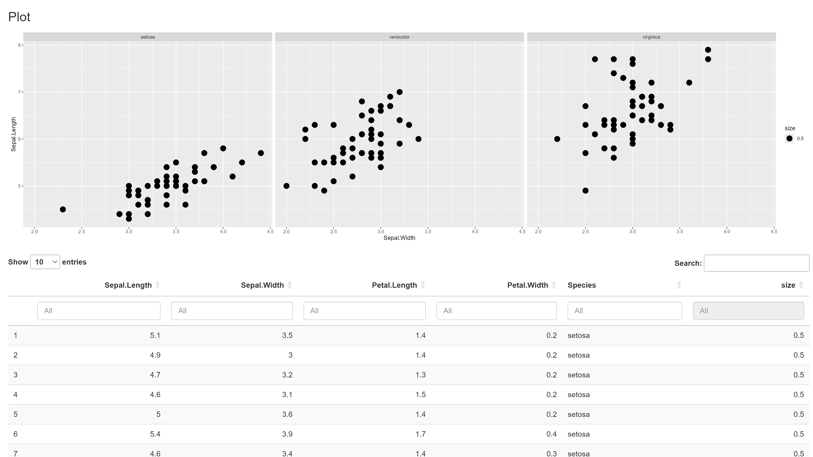
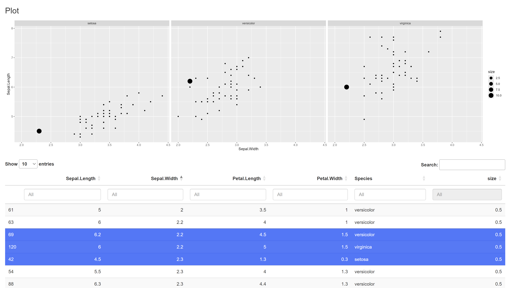

```{r, include = FALSE}
knitr::opts_chunk$set(
  collapse = TRUE,
  comment = "#>"
)
```

## The `ShinyModule` Class
The `ShinyModule` class is an interface to be inherited to create modules. The module class does some simple, yet convenient things:

- It stores the `appId` used for `shiny::NS()` or `session$ns()`.
- It stores the `moduleName` or rather the class name of the module.
- It stores the `instanceId` of the class.
- It stores the `parentNamespace` of a parent module.
- It enables you to use the re-use references for similar outputs in different modules. The `ShinyModule` will add the correct namespacing for you when you use `shiny::NS()` 

## Overrides
When inheriting the `ShinyModule` class it is expected that you override the `UI()` and / or `server()` methods. The `UI()` method should return something akin to a `shiny::tagList()`. By default they are defined, but do nothing. This allows for just rendering simple text in a module, without any back-end like the `DarwinShinyModules::Text` module. Or a static image.

## Defining a new module
The base interface of creating a new module would be this:
```{r}
library(DarwinShinyModules)

MyModule <- R6::R6Class(
  classname = "MyModule",
  inherit = ShinyModule,

  private = list(
    # Override UI()
    .UI = function() {},

    # Override server()
    .server = function(input, output, session) {}
  )
)
```

As you can see it is a new `R6` class inheriting from `DarwinShinyModules::ShinyModule` with a `UI` and a `server` method. For a new module you can either directly add functionality to these functions, and use `private` and `active` fields and methods within the `R6` framework. Or if you are more familiar with functions, you may want to call your own `server` and `ui` functions in the module, like so:

```{r}
library(DarwinShinyModules)
library(shiny)

myUi <- fluidPage(
  tableOutput(outputId = shiny::NS("id", "table"))
)

myServer <- function(input, output, session) {
  output$table <- renderTable({
    head(iris)
  })
}

MyModule <- R6::R6Class(
  classname = "MyModule",
  inherit = ShinyModule,

  private = list(
    # Override UI()
    .UI = function() {
      myUi
    },

    # Override server()
    .server = function(input, output, session) {
      myServer(input, output, session)
    }
  )
)
```

Let's remake `MyModule` putting all the functionality directly on the module, and see what extra funcionality and information exists on the module. In this module I want to:

- Display the `head()` of the `iris` data frame, using `"myTable"` as the `input` / `output` reference.
- Display the `appId`, `moduleName`, and `instanceId`, using `"moduleData"` as the `input` / `output` reference.

```{r}
library(DarwinShinyModules)

MyModule <- R6::R6Class(
  classname = "MyModule",
  inherit = ShinyModule,

  active = list(
    # Additional active binding field, to fetch the private field .data
    data = function() return(private$.data)
  ),

  private = list(
    # Additional private field, containing the `iris` data.frame
    .data = iris,

    # Override UI()
    .UI = function() {
      shiny::tagList(
        # Output a table "input$app-MyModule_ABCDEFGHIJ__myTable"
        shiny::tableOutput(outputId = shiny::NS(private$.namespace, "myTable")),
        # Output HTML "input$app-MyModule_ABCDEFGHIJ_moduleData"
        shiny::uiOutput(outputId = shiny::NS(private$.namespace, "moduleData"))
      )
    },

    # Override server()
    .server = function(input, output, session) {
      output$myTable <- shiny::renderTable({
        head(private$.data)
      })
      
      # Render the HTML to "MyModule_ABCDEFGHIJ_moduleData"
      output$moduleData <- shiny::renderUI({
        shiny::HTML(paste(
          sprintf("App ID: %s", private$.moduleId),
          sprintf("Module Name: %s", private$.moduleName),
          sprintf("Instance ID: %s", private$.instanceId),
          sep = "<br/>"
        ))
      })
    }
  )
)
```

To initialize our module object we call the `new()` method on our defined `MyModule`:
```{r}
module <- MyModule$new()
```

To see what the module contains we can simply `print()` the module instance:
```{r}
print(module)
```
There are several items listed under Public: `appId`, `clone()`, `data`, `id()` `initialize()`, `instanceId`, `moduleName`, `server()`, `UI()`, and `validate()`. Note that `appId`, `data`, `instanceId`, and `moduleName` have a Private counter parts: `.appId`, `.data`, `.instanceId`, `moduleName`.

We can get the active fields of our module `MyModule` like so:
```{r}
module$moduleId
module$instanceId
module$moduleName
head(module$data)
```

Notice that if we initialize multiple instances of the same type of module the `instanceId` is different per instance:
```{r}
mod1 <- MyModule$new()
mod2 <- MyModule$new()
mod3 <- MyModule$new()

mod1$instanceId
mod2$instanceId
mod3$instanceId
```


We can spin up a simple shiny app using our module:
```{r}
ui <- shiny::fluidPage(
  module$UI()
)

server <- function(input, output, session) {
  module$server(input, output, session)
}

if (interactive()) {
  shiny::shinyApp(ui, server)
}
```


## Multiple Modules in one ShinyApp
We can also combine multiple modules into one ShinyApp.

We can make a new module called: `MyModule2` which inherits from `MyModule`. I want the module to be exactly the same, but instead of looking at the `iris` data, I want to look at `mtcars`.

```{r}
MyModule2 <- R6::R6Class(
  classname = "MyModule2",
  inherit = MyModule,
  private = list(
    .data = mtcars
  )
)

# initialize a MyModule2 instance
module2 <- MyModule2$new()
```

We can spin up a new ShinyApp:
```{r}
ui <- shiny::fluidPage(
  module$UI(),
  module2$UI()
)

server <- function(input, output, session) {
  module$server(input, output, session)
  module2$server(input, output, session)
}

if (interactive()) {
  shiny::shinyApp(ui, server)
}
```


## Nesting modules
Modules may be nested in other modules. The nested modules can communicate data to one another.

Let's conciser the following plot function, for the `iris` dataset. We add an arbitrary size column for this example, which we will manipulate later to change the plot.
```{r}
data <- iris
data$size <- 0.5

plotFun <- function(data) {
  ggplot2::ggplot(data = data) +
    ggplot2::geom_point(mapping = ggplot2::aes(x = Sepal.Width, y = Sepal.Length, size = size)) +
    ggplot2::facet_grid(. ~ Species)
}

plotFun(data)
```

What we will do is create two modules, a `Table` and `plotStatic` module, in a parent module, `ExampleModule`.

Let's create our base module first: `ExampleModule`.
```{r}
ExampleModule <- R6::R6Class(
  classname = "ExampleModule",
  inherit = ShinyModule,

  private = list(
    .UI = function() {},
    
    .server = function(input, output, session) {}
  )
)
```

We can now add our modules that we want to nest into this `ExampleModule`, when the module is initialized.
```{r}
ExampleModule <- R6::R6Class(
  classname = "ExampleModule",
  inherit = ShinyModule,
  
  public = list(
    # We are overriding the initialize of `ShinyModule` here
    initialize = function(data) {
      # So we call `super$initialize()` to make sure we still initialize properly
      super$initialize()
      # We are now free to add extra things

      # We add a `Table` module, with the `iris` data set, with no title.
      private$.table <- Table$new(data = data, title = NULL)

      # We add a `PlotStatic` module with same data, also the  `iris` dataset.
      private$.plot <- PlotStatic$new(fun = plotFun, args = list(data = data))
      # In order to add the `private$.table` and `private$.plot` we add them to
      # our private environment. So they are accessable in all other methods
      # like the `.server()` and `.UI()` methods.

      # in order to make sure the namespacing is done correctly, we must update
      # the `parentNamespace` fields in both the `Table` and `PlotStatic` modules.
      # The `parentNamespace` is the namespace of the overarching module, which
      # we can access with `self$namespace`
      private$.table$parentNamespace <- self$namespace
      private$.plot$parentNamespace <- self$namespace
    }
  ),

  private = list(
    # We MUST initialize the private fields. This makes sure the fields exist
    # when we write to them in `initialize()`.
    .table = NULL,
    .plot = NULL,

    .UI = function() {},
    
    .server = function(input, output, session) {}
  )
)
```

With our modules added, we can call their respective `server()` and `UI()` methods in our module.
```{r}
ExampleModule <- R6::R6Class(
  classname = "ExampleModule",
  inherit = ShinyModule,
  
  public = list(
    initialize = function(data) {
      super$initialize()

      # Create modules
      private$.table <- Table$new(data = data, title = NULL)
      private$.plot <- PlotStatic$new(fun = plotFun, args = list(data = data))

      # Set `parentNamespace`
      private$.table$parentNamespace <- self$namespace
      private$.plot$parentNamespace <- self$namespace
    }
  ),

  private = list(
    .table = NULL,
    .plot = NULL,

    .UI = function() {
      # We must wrap the individual components in something like a `tagList()`,
      # `fluidPage()`, or something similar.
      shiny::tagList(
        private$.plot$UI(),
        private$.table$UI()
      )
    },
    
    .server = function(input, output, session) {
      private$.plot$server(input, output, session)
      private$.table$server(input, output, session)
    }
  )
)
```

And now that we have something to look at, let's preview our module
```{r}
mod <- ExampleModule$new(data = data)

if (interactive()) {
  preview(mod)
}
```
{#id .class width=100%}
The `Table` and `PlotStatic` modules are now independent from one another. However, we can change that by adding some extra code in the `.server()` method.
```{r}
ExampleModule <- R6::R6Class(
  classname = "ExampleModule",
  inherit = ShinyModule,
  
  public = list(
    initialize = function(data) {
      super$initialize()

      # Create modules
      private$.table <- Table$new(data = data, title = NULL)
      private$.plot <- PlotStatic$new(fun = plotFun, args = list(data = data))

      # Set `parentNamespace`
      private$.table$parentNamespace <- self$namespace
      private$.plot$parentNamespace <- self$namespace
    }
  ),

  private = list(
    .table = NULL,
    .plot = NULL,

    .UI = function() {
      shiny::tagList(
        private$.plot$UI(),
        private$.table$UI()
      )
    },
    
    .server = function(input, output, session) {
      private$.plot$server(input, output, session)
      private$.table$server(input, output, session)

      # `private$.table$bindings$rows_selected` is a binding exposed by the
      # `Table` module. It is a binding from the `DT` package that allows is to
      # see which rows are selected in the table. We can observe this specific
      # event with `observeEvent()`
      shiny::observeEvent(private$.table$bindings$rows_selected, {
        # The `PlotX` modules expose an `args` binding to get access to it's
        # arguments that it uses for plotting. Our `data` argument is there that
        # we specified in `plotFun()`
        private$.plot$args$data[, "size"] <- 0.5
        # We reset the `size` to 0.5 whenever the event triggers.
        
        # We then fetch the rows which rows are selected in the `Table` module
        selectedRows <- private$.table$bindings$rows_selected
        
        # We then update the`"size"` column to change the size to `10` for all
        # the selected rows.
        private$.plot$args$data[selectedRows, "size"] <- 10
      })
    }
  )
)
```

We can preview our module again.
```{r}
mod <- ExampleModule$new(data = data)

if (interactive()) {
  preview(mod)
}
```
{#id .class width=100%}

We can see that if we select rows in our table, the size updates in the plot for the selected row.

All the code we used then looks like this:
```{r}
# Format data
data <- iris
data$size <- 0.5

# Plot function
plotFun <- function(data) {
  ggplot2::ggplot(data = data) +
    ggplot2::geom_point(mapping = ggplot2::aes(x = Sepal.Width, y = Sepal.Length, size = size)) +
    ggplot2::facet_grid(. ~ Species)
}

# Module definition
ExampleModule <- R6::R6Class(
  classname = "ExampleModule",
  inherit = ShinyModule,
  
  public = list(
    initialize = function(data) {
      super$initialize()

      # Create modules
      private$.table <- Table$new(data = data, title = NULL)
      private$.plot <- PlotStatic$new(fun = plotFun, args = list(data = data))

      # Set `parentNamespace`
      private$.table$parentNamespace <- self$namespace
      private$.plot$parentNamespace <- self$namespace
    }
  ),

  private = list(
    .table = NULL,
    .plot = NULL,

    .UI = function() {
      shiny::tagList(
        private$.plot$UI(),
        private$.table$UI()
      )
    },
    
    .server = function(input, output, session) {
      # Pre-specified plot and table code
      private$.plot$server(input, output, session)
      private$.table$server(input, output, session)

      # Communication code
      shiny::observeEvent(private$.table$bindings$rows_selected, {
        private$.plot$args$data[, "size"] <- 0.5
        selectedRows <- private$.table$bindings$rows_selected
        private$.plot$args$data[selectedRows, "size"] <- 10
      })
    }
  )
)
```

