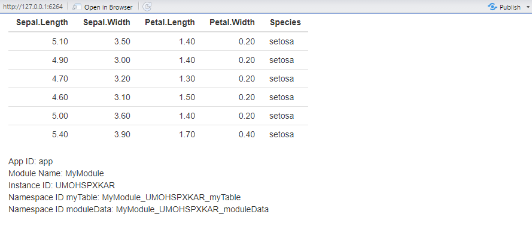
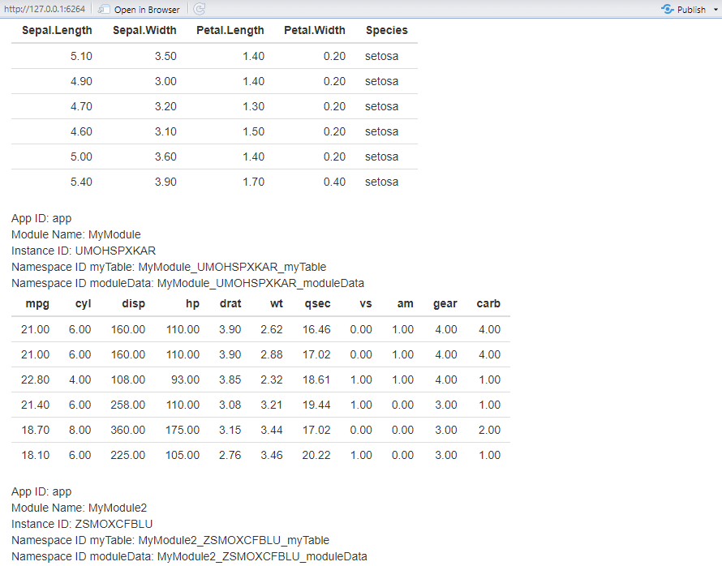
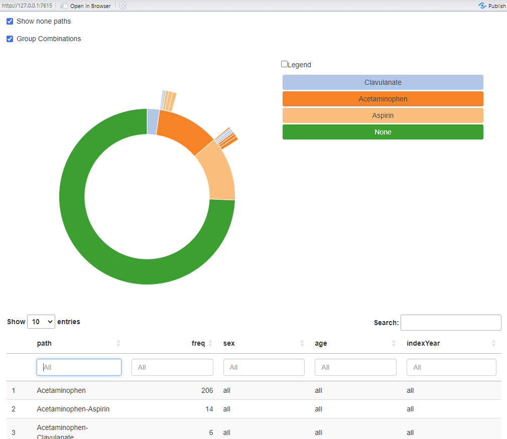

```{r, include = FALSE}
knitr::opts_chunk$set(
  collapse = TRUE,
  comment = "#>"
)
```

## The `ShinyModule` Class
The `ShinyModule` class is an interface to be inherited to create modules. The module class does some simple, yet convenient things:

- It stores the `appId` used for `shiny::NS()` or `session$ns()`.
- It stores the `moduleName` or rather the class name of the module.
- It stores the `instanceId` of the class.
- It enables you to use the `id()` method for inherited modules. Which uses the `moduleName`, `instanceId` and an `inputId` or `outputId` to create a unique reference within the namespace. This enables multiple (duplicate) modules to use the same short-hand reference. As an example the complete reference for a table would be: `app-Module_ABCDEFGHIJ_table`. Where `app` is the namespace of the entire ShinyApp, `Module` is the name of the module, `ABCDEFGHIJ` is the instance ID of the instance of the module, and `table` is the short hand reference to the table in the `input` or `output`.

## Overrides
When inheriting the `ShinyModule` class it is expected that you override the `UI()` and / or `server()` methods. The `UI()` method should return something akin to a `shiny::tagList()`. By default they are defined, but do nothing. This allows for just rendering simple text in a module, without any back-end like the `DarwinShinyModules::Text` module. Or a static image.

## Defining a new module
Let's define a new module called `MyModule`. In this module I want to:

- Display the `head()` of the `iris` data frame, using `"myTable"` as the `input` / `output` reference.
- Display the `appId`, `moduleName`, and `instanceId`, using `"moduleData"` as the `input` / `output` reference.

```{r}
library(DarwinShinyModules)

MyModule <- R6::R6Class(
  classname = "MyModule",
  inherit = ShinyModule,

  public = list(
    # Override UI()
    UI = function() {
      shiny::tagList(
        # Output a table "input$app-MyModule_ABCDEFGHIJ__myTable"
        shiny::tableOutput(outputId = shiny::NS(private$.appId, self$id("myTable"))),
        # Output HTML "input$app-MyModule_ABCDEFGHIJ_moduleData"
        shiny::uiOutput(outputId = shiny::NS(private$.appId, self$id("moduleData")))
      )
    },

    # Override server()
    server = function(input, output, session) {
      # Render the table to "MyModule_ABCDEFGHIJ_myTable"
      output[[self$id("myTable")]] <- shiny::renderTable({
        head(private$.data)
      })
      
      # Render the HTML to "MyModule_ABCDEFGHIJ_moduleData"
      output[[self$id("moduleData")]] <- shiny::renderUI({
        shiny::HTML(paste(
          sprintf("App ID: %s", private$.appId),
          sprintf("Module Name: %s", private$.moduleName),
          sprintf("Instance ID: %s", private$.instanceId),
          sprintf("Namespace ID myTable: %s", self$id("myTable")),
          sprintf("Namespace ID moduleData: %s", self$id("moduleData")),
          sep = "<br/>"
        ))
      })
    }
  ),

  private = list(
    # Additional private field, containing the `iris` data.frame
    .data = iris
  ),

  active = list(
    # Additional active binding field, to fetch the private field .data
    data = function() return(private$.data)
  )
)
```

To initialize our module object we call the `new()` method on our defined `MyModule`:
```{r}
module <- MyModule$new(appId = "app")
```

To see what the module contains we can simply `print()` the module instance:
```{r}
print(module)
```
There are several items listed under Public: `appId`, `clone()`, `data`, `id()` `initialize()`, `instanceId`, `moduleName`, `server()`, `UI()`, and `validate()`. Note that `appId`, `data`, `instanceId`, and `moduleName` have a Private counter parts: `.appId`, `.data`, `.instanceId`, `moduleName`.

We can get the active fields of our module `MyModule` like so:
```{r}
module$appId
module$instanceId
module$moduleName
head(module$data)
```

Notice that if we initialize multiple instances of the same type of module the `instanceId` is different per instance:
```{r}
mod1 <- MyModule$new("app")
mod2 <- MyModule$new("app")
mod3 <- MyModule$new("app")

mod1$instanceId
mod2$instanceId
mod3$instanceId
```


We can spin up a simple shiny app using our module:
```{r}
ui <- shiny::fluidPage(
  module$UI()
)

server <- function(input, output, session) {
  shiny::moduleServer(id = "app", module = function(input, output, session) {
    module$server(input, output, session)
  })
}

if (interactive()) {
  shiny::shinyApp(ui, server)
}
```


## Multiple Modules in one ShinyApp
We can also combine multiple modules into one ShinyApp.

We can make a new module called: `MyModule2` which inherits from `MyModule`. I want the module to be exactly the same, but instead of looking at the `iris` data, I want to look at `mtcars`.

```{r}
MyModule2 <- R6::R6Class(
  classname = "MyModule2",
  inherit = MyModule,
  private = list(
    .data = mtcars
  )
)

# initialize a MyModule2 instance
module2 <- MyModule2$new("app")
```

We can spin up a new ShinyApp:
```{r}
ui <- shiny::fluidPage(
  module$UI(),
  module2$UI()
)

server <- function(input, output, session) {
  shiny::moduleServer(id = "app", module = function(input, output, session) {
    module$server(input, output, session)
    module2$server(input, output, session)
  })
}

if (interactive()) {
  shiny::shinyApp(ui, server)
}
```


## Nesting modules
Modules may be nested in other modules. For instance the `Sunburst` module, is composed of the `PlotWidget` and `Table` modules.


The `Sunburst` module displays a `data.frame` result of the `TreatmentPatterns` package. The nested `Table` module displays the `data.frame` as a `DT` DataTable. The nested `PlotWidget` module displays a sunburst plot as a `HtmlWidget`.

```{r}
tp <- read.csv(system.file(
  package = "DarwinShinyModules",
  "dummyData/TreatmentPatterns/csv/treatmentPathways.csv"
))

sunburst <- Sunburst$new(appId = "app", tp)

ui <- shiny::fluidPage(
  sunburst$UI()
)

server <- function(input, output, session) {
  shiny::moduleServer(id = "app", module = function(input, output, session) {
    sunburst$server(input, output, session)
  })
}

if (interactive()) {
  shiny::shinyApp(ui, server)
}
```


The nested modules do not know what data the other nested modules holds. But the `Sunburst` module does, and thus does all the data management for both modules.

DataTables from the `DT` package come with baked in filters for each column. `DT` provides bindings to the DataTable object to see what rows are shown, or which filters are applied. The `Table` modules exposes these bindings in a reactive context. These bindings can then be used by the `Sunburst` module to change data used for the `PlotWidget` module which manges the sunburst plot.


