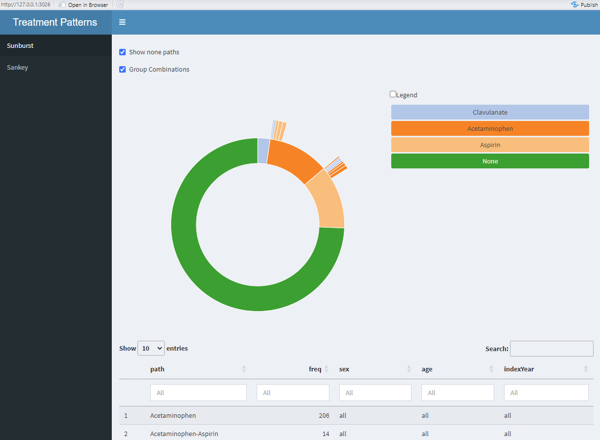
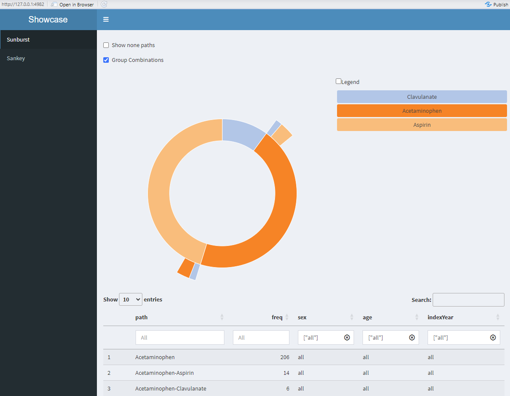
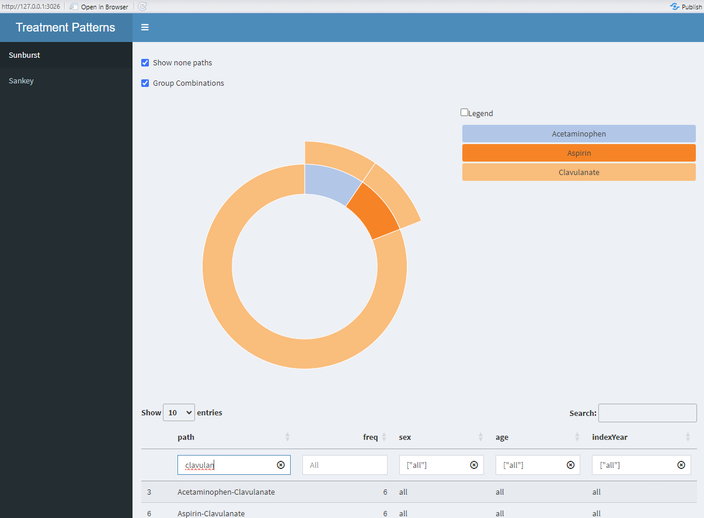
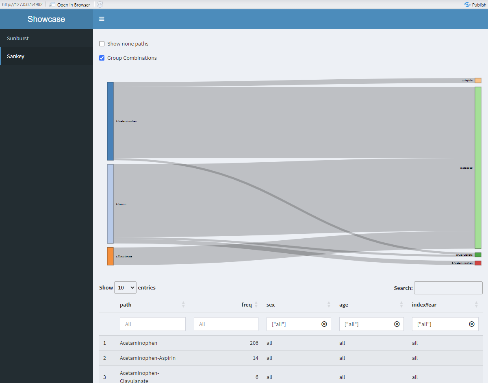

```{r, include = FALSE}
knitr::opts_chunk$set(
  collapse = TRUE,
  comment = "#>"
)
```

## Modules
There are three Modules related to `TreatmentPatterns`:
1. `TreatmentPatterns`, interface for `Sunburst` and `Sankey`.
2. `Sunburst`, Sunburst plot module consisting of a `Widget` and `Table` module.
3. `Sankey`, Sankey diagram module consisting of a `Widget` and `Table` module.

Both the `Sunburst` and `Sankey` module inherit from the `TreatmentPatterns` interface.

```{r}
library(DarwinShinyModules)
library(shiny)
library(shinydashboard)
library(TreatmentPatterns)

# Read in dummy data
tp <- read.csv(system.file(
  package = "DarwinShinyModules",
  "dummyData/TreatmentPatterns/csv/treatmentPathways.csv"
))

# Initialize modules
sunburstModule <- Sunburst$new("app", tp)
sankeyModule <- Sankey$new("app", tp)

ui <- dashboardPage(
  header = dashboardHeader(title = "Treatment Patterns"),

  sidebar = dashboardSidebar(sidebarMenu(
    shinydashboard::menuItem(text = "Sunburst", tabName = "sunburst"),
    shinydashboard::menuItem(text = "Sankey", tabName = "sankey")
  )),

  body = dashboardBody(
    shinydashboard::tabItems(
      shinydashboard::tabItem(
        tabName = "sunburst",
        sunburstModule$UI()
      ),
      shinydashboard::tabItem(
        tabName = "sankey",
        sankeyModule$UI()
      )
    )
  )
)

server <- function(input, output, session) {
  moduleServer("app", function(input, output, session) {
    sunburstModule$server(input, output, session)
    sankeyModule$server(input, output, session)
  })
}

if (interactive()) {
  shiny::shinyApp(ui, server)
}
```

By default all paths are shown for all strata.


We are able to filter the data in the table for specific strata.


It is also possible to search for a specific treatment in the pathways:


The same is be possible for the Sankey diagram.

